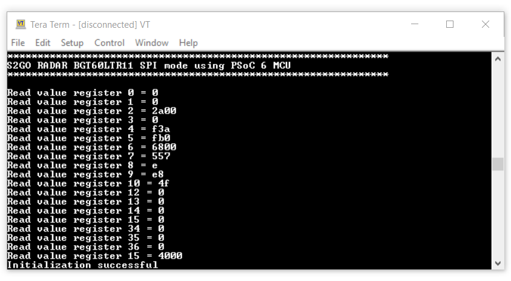

# S2GO RADAR BGT60LTR11 SPI mode using PSoC&trade; 6 MCU
Disclaimer: This is a community code example (CCE) released for the benefit of the community users. These projects have only been tested for the listed BSPs, tools versions, and toolchains documented in this readme. They are intended to demonstrate how a solution / concept / use-case can be achieved on a particular device.


This code example demonstrates how to interface Infineon's [S2GO RADAR BGT60LTR11](https://www.infineon.com/cms/en/product/evaluation-boards/s2go-radar-bgt60ltr11/) board with PSoC6&trade; via SPI using Eclipse IDE for ModusToolbox&trade;. This code demonstrates the procedure to detect target motion and direction, as well as raw internal ADC readings.   


[Provide feedback on this code example.](https://cypress.co1.qualtrics.com/jfe/form/SV_1NTns53sK2yiljn?Q_EED=eyJVbmlxdWUgRG9jIElkIjoiQ0UyMjE3NzMiLCJTcGVjIE51bWJlciI6IjAwMi0yMTc3MyIsIkRvYyBUaXRsZSI6IlBTb0MmdHJhZGU7IDYgTUNVOiBIZWxsbyB3b3JsZCIsInJpZCI6ImFydmkiLCJEb2MgdmVyc2lvbiI6IjIuMi4wIiwiRG9jIExhbmd1YWdlIjoiRW5nbGlzaCIsIkRvYyBEaXZpc2lvbiI6Ik1DRCIsIkRvYyBCVSI6IklDVyIsIkRvYyBGYW1pbHkiOiJQU09DIn0=)

## Requirements

- [ModusToolbox&trade; software](https://www.infineon.com/cms/en/design-support/tools/sdk/modustoolbox-software/?utm_source=cypress&utm_medium=referral&utm_campaign=202110_globe_en_all_integration-product_families&redirId=Product401) v2.4.0 (tested with v2.4.0)

   Note: This code example version requires ModusToolbox&trade; software version 2.4 and may not be compatible with other versions
- Board support package (BSP) minimum required version: 3.0.0
- Programming language: C
- Associated parts: All [PSoC&trade; 6 MCU](https://www.infineon.com/cms/en/product/microcontroller/32-bit-psoc-arm-cortex-microcontroller/psoc-6-32-bit-arm-cortex-m4-mcu/?utm_source=cypress&utm_medium=referral&utm_campaign=202110_globe_en_all_integration-product_families&redirId=VL1864)


## Supported toolchains (make variable 'TOOLCHAIN')

- GNU Arm&reg; embedded compiler v10.3 (`GCC_ARM`) - Default value of `TOOLCHAIN`
- Arm&reg; compiler v6.13 (`ARM`)
- IAR C/C++ compiler v8.42.2 (`IAR`)

## Supported Sensor Boards
<table>
    <tr>
        <td align="center"></td>
    </tr>
    <tr>
        <td style="text-align: center"><a href="https://www.infineon.com/cms/en/product/evaluation-boards/s2go-radar-bgt60ltr11">S2GO RADAR BGT60LTR11</a></td>
    </tr>
</table>


## Supported kits (make variable 'TARGET')


- [PSoC&trade; 6 Wi-Fi Bluetooth&reg; pioneer kit](https://www.infineon.com/cms/en/product/evaluation-boards/cy8ckit-062-wifi-bt/?utm_source=cypress&utm_medium=referral&utm_campaign=202110_globe_en_all_integration-dev_kit&redirId=VL1509) (`CY8CKIT-062-WIFI-BT`) – Default value of `TARGET`


## Hardware setup

This example requires the Infineon's [S2GO RADAR BGT60LTR11](https://www.infineon.com/cms/en/product/evaluation-boards/s2go-radar-bgt60ltr11/) to be interfaced with PSoC&trade; 6 MCU using one of the supported kits.

**Note:** The PSoC&trade; 6 Bluetooth&reg; LE pioneer kit (CY8CKIT-062-BLE) and the PSoC&trade; 6 Wi-Fi Bluetooth&reg; pioneer kit (CY8CKIT-062-WIFI-BT) ship with KitProg2 installed. The ModusToolbox&trade; software requires KitProg3. Before using this code example, make sure that the board is upgraded to KitProg3. The tool and instructions are available in the [Firmware Loader](https://github.com/Infineon/Firmware-loader) GitHub repository. If you do not upgrade, you will see an error like "unable to find CMSIS-DAP device" or "KitProg firmware is out of date".

Use jumper wires to establish a connection between S2GO RADAR BGT60LTR11 and the PSoC&trade; 6 Wi-Fi Bluetooth&reg; pioneer kit as mentioned below.

1. Connect 3.3V of sensor to 3V3 supply on the kit.
2. Connect GND of sensor to GND of the kit.
3. Connect the SPI lines - MOSI, MISO, CLK and CS of the sensor to P10[0], P10[1], P10[2], P10[3] respectively.
4. Connect P_det and T_det to P9[0] and P9[1] of kit respectively.

## Software setup

Install a terminal emulator if you don't have one. Instructions in this document use [Tera Term](https://ttssh2.osdn.jp/index.html.en).

This example requires no additional software or tools.


## Using the code example

Create the project and open it using one of the following:

<details><summary><b>In Eclipse IDE for ModusToolbox&trade; software</b></summary>

1. Click the **New Application** link in the **Quick Panel** (or, use **File** > **New** > **ModusToolbox Application**). This launches the [Project Creator](https://www.infineon.com/dgdl/Infineon-ModusToolbox_Project_Creator_2.0_User_Guide-UserManual-v01_00-EN.pdf?fileId=8ac78c8c8386267f0183a973003f59b3&utm_source=cypress&utm_medium=referral&utm_campaign=202110_globe_en_all_integration-files&redirId=180675&redirId=VL140) tool.

2. Pick a kit supported by the code example from the list shown in the **Project Creator - Choose Board Support Package (BSP)** dialog.

   When you select a supported kit, the example is reconfigured automatically to work with the kit. To work with a different supported kit later, use the [Library Manager](https://www.infineon.com/dgdl/Infineon-ModusToolbox_Library_Manager_2.0_User_Guide-UserManual-v01_00-EN.pdf?fileId=8ac78c8c8386267f0183a960c5945992&utm_source=cypress&utm_medium=referral&utm_campaign=202110_globe_en_all_integration-files&redirId=180679&redirId=VL142) to choose the BSP for the supported kit. You can use the Library Manager to select or update the BSP and firmware libraries used in this application. To access the Library Manager, click the link from the **Quick Panel**.

   You can also just start the application creation process again and select a different kit.

   If you want to use the application for a kit not listed here, you may need to update the source files. If the kit does not have the required resources, the application may not work.

3. In the **Project Creator - Select Application** dialog, choose the example by enabling the checkbox.

4. (Optional) Change the suggested **New Application Name**.

5. The **Application(s) Root Path** defaults to the Eclipse workspace which is usually the desired location for the application. If you want to store the application in a different location, you can change the *Application(s) Root Path* value. Applications that share libraries should be in the same root path.

6. Click **Create** to complete the application creation process.

For more details, see the [Eclipse IDE for ModusToolbox&trade; software user guide](https://www.infineon.com/dgdl/Infineon-ModusToolbox_3.0_Eclipse_IDE_User_Guide-GettingStarted-v01_00-EN.pdf?fileId=8ac78c8c8386267f0183a8d7043b58ee&utm_source=cypress&utm_medium=referral&utm_campaign=202110_globe_en_all_integration-files&redirId=188241&redirId=VL3973) (locally available at *{ModusToolbox&trade; software install directory}/ide_{version}/docs/mt_ide_user_guide.pdf*).

</details>

<details><summary><b>In command-line interface (CLI)</b></summary>

ModusToolbox&trade; software provides the Project Creator as both a GUI tool and the command line tool, "project-creator-cli". The CLI tool can be used to create applications from a CLI terminal or from within batch files or shell scripts. This tool is available in the *{ModusToolbox&trade; software install directory}/tools_{version}/project-creator/* directory.

Use a CLI terminal to invoke the "project-creator-cli" tool. On Windows, use the command line "modus-shell" program provided in the ModusToolbox&trade; software installation instead of a standard Windows command-line application. This shell provides access to all ModusToolbox&trade; software tools. You can access it by typing `modus-shell` in the search box in the Windows menu. In Linux and macOS, you can use any terminal application.

This tool has the following arguments:

Argument | Description | Required/optional
---------|-------------|-----------
`--board-id` | Defined in the `<id>` field of the [BSP](https://github.com/Infineon?q=bsp-manifest&type=&language=&sort=) manifest | Required
`--app-id`   | Defined in the `<id>` field of the [CE](https://github.com/Infineon?q=ce-manifest&type=&language=&sort=) manifest | Required
`--target-dir`| Specify the directory in which the application is to be created if you prefer not to use the default current working directory | Optional
`--user-app-name`| Specify the name of the application if you prefer to have a name other than the example's default name | Optional

<br>

The following example will clone the "[Hello world](https://github.com/Infineon/mtb-example-psoc6-hello-world)" application with the desired name "MyHelloWorld" configured for the *CY8CKIT-062-WIFI-BT* BSP into the specified working directory, *C:/mtb_projects*:

   ```
   project-creator-cli --board-id CY8CKIT-062-WIFI-BT --app-id mtb-example-psoc6-hello-world --user-app-name MyHelloWorld --target-dir "C:/mtb_projects"
   ```

**Note:** The project-creator-cli tool uses the `git clone` and `make getlibs` commands to fetch the repository and import the required libraries. For details, see the "Project creator tools" section of the [ModusToolbox&trade; software user guide](https://www.infineon.com/dgdlac/Infineon-Infineon-ModusToolbox_3_0_Tools_Package_User_Guide-GettingStarted-v01_00-EN-UserManual-v19_00-EN.pdf?fileId=8ac78c8c8386267f0183a8e9720c5915) (locally available at *{ModusToolbox&trade; software install directory}/docs_{version}/mtb_user_guide.pdf*).

</details>

<details><summary><b>In third-party IDEs</b></summary>

Use one of the following options:

- **Use the standalone [Project Creator](https://www.infineon.com/dgdl/Infineon-ModusToolbox_Project_Creator_2.0_User_Guide-UserManual-v01_00-EN.pdf?fileId=8ac78c8c8386267f0183a973003f59b3&utm_source=cypress&utm_medium=referral&utm_campaign=202110_globe_en_all_integration-files&redirId=180675&redirId=VL140) tool:**

   1. Launch Project Creator from the Windows Start menu or from *{ModusToolbox&trade; software install directory}/tools_{version}/project-creator/project-creator.exe*.

   2. In the initial **Choose Board Support Package** screen, select the BSP, and click **Next**.

   3. In the **Select Application** screen, select the appropriate IDE from the **Target IDE** drop-down menu.

   4. Click **Create** and follow the instructions printed in the bottom pane to import or open the exported project in the respective IDE.

<br>

- **Use command-line interface (CLI):**

   1. Follow the instructions from the **In command-line interface (CLI)** section to create the application, and then import the libraries using the `make getlibs` command.

   2. Export the application to a supported IDE using the `make <ide>` command.

   3. Follow the instructions displayed in the terminal to create or import the application as an IDE project.

For a list of supported IDEs and more details, see the "Exporting to IDEs" section of the [ModusToolbox&trade; software user guide](https://www.infineon.com/dgdlac/Infineon-Infineon-ModusToolbox_3_0_Tools_Package_User_Guide-GettingStarted-v01_00-EN-UserManual-v19_00-EN.pdf?fileId=8ac78c8c8386267f0183a8e9720c5915) (locally available at *{ModusToolbox&trade; software install directory}/docs_{version}/mtb_user_guide.pdf*).

</details>


## Operation


1. Connect the board to your PC using the provided USB cable through the KitProg3 USB connector.

2. Open a terminal program and select the KitProg3 COM port. Set the serial port parameters to 8N1 and 115200 baud rate.

3. Program the board using one of the following:

   <details><summary><b>Using Eclipse IDE for ModusToolbox&trade; software</b></summary>

      1. Select the application project in the Project Explorer.

      2. In the **Quick Panel**, scroll down, and click **\<Application Name> Program (KitProg3_MiniProg4)**.
   </details>

   <details><summary><b>Using CLI</b></summary>

     From the terminal, execute the `make program` command to build and program the application using the default toolchain to the default target. The default toolchain and target are specified in the application's Makefile but you can override those values manually:
      ```
      make program TARGET=<BSP> TOOLCHAIN=<toolchain>
      ```

      Example:
      ```
      make program TARGET=CY8CPROTO-062-4343W TOOLCHAIN=GCC_ARM
      ```
   </details>

4. After programming, the application starts automatically. Confirm that "PSoC 6 MCU: BGT60LTR11 RADAR example" is displayed on the UART terminal.


   **Figure 1. Terminal output on program startup**

   


5. Confirm that the result corresponding to the selected appropriate output mode is displayed in the terminal at approximately 1Hz.


## Debugging

You can debug the example to step through the code. In the IDE, use the **\<Application Name> Debug (KitProg3_MiniProg4)** configuration in the **Quick Panel**. For details, see the "Program and debug" section in the [Eclipse IDE for ModusToolbox&trade; software user guide](https://www.infineon.com/dgdl/Infineon-ModusToolbox_3.0_Eclipse_IDE_User_Guide-GettingStarted-v01_00-EN.pdf?fileId=8ac78c8c8386267f0183a8d7043b58ee&utm_source=cypress&utm_medium=referral&utm_campaign=202110_globe_en_all_integration-files&redirId=188241&redirId=VL3973).

**Note:** **(Only while debugging)** On the CM4 CPU, some code in `main()` may execute before the debugger halts at the beginning of `main()`. This means that some code executes twice – once before the debugger stops execution, and again after the debugger resets the program counter to the beginning of `main()`. See [KBA231071](https://community.infineon.com/t5/Knowledge-Base-Articles/PSoC-6-MCU-Code-in-main-executes-before-the-debugger-halts-at-the-first-line-of/ta-p/253856) to learn about this and for the workaround.


## Design and implementation
The example initializes the BSP and SPI using the driver APIs.
It then initializes the BGT60LTR11AIP Radar sensor using the API's provided by the bgt60ltr11_mtb library.
After successful initialization, it performs the corresponding function according to the selected mode, every 1 second.
It then displays the output result on the serial terminal as shown in  Figure 1.
### Resources and settings

**Table 1. Application resources**

 Resource  |  Alias/object     |    Purpose
 :-------- | :-------------    | :------------
 BGT60LTR11 Radar object    |  bgt60ltr11_obj         |  BGT60LTR11 radar object including PSoC6 HAL specialization
 UART (HAL)|cy_retarget_io_uart_obj| UART HAL object used by retarget-io for the debug UART port 


<br>

## Related resources

Resources  | Links
-----------|----------------------------------
Application notes  | [AN228571](https://www.infineon.com/dgdl/Infineon-AN228571_Getting_started_with_PSoC_6_MCU_on_ModusToolbox_software-ApplicationNotes-v06_00-EN.pdf?fileId=8ac78c8c7cdc391c017d0d36de1f66d1&utm_source=cypress&utm_medium=referral&utm_campaign=202110_globe_en_all_integration-an_vanitylink&redirId=AN_VL726) – Getting started with PSoC&trade; 6 MCU on ModusToolbox&trade; software <br>  [AN215656](https://www.infineon.com/dgdl/Infineon-AN215656_PSoC_6_MCU_Dual-CPU_System_Design-ApplicationNotes-v09_00-EN.pdf?fileId=8ac78c8c7cdc391c017d0d3180c4655f&utm_source=cypress&utm_medium=referral&utm_campaign=202110_globe_en_all_integration-an_vanitylink&redirId=AN_VL660) – PSoC&trade; 6 MCU: Dual-CPU system design <br> [AN650](https://www.infineon.com/dgdl/Infineon-AN650_BGT60LTR11AIP_Radar_Shield2Go_V1.0-ApplicationNotes-v01_00-EN.pdf?fileId=8ac78c8c872bd8d601872e0c3d112503) –  BGT60LTR11AIP Radar Shield2Go <br>
Code examples  | [Using ModusToolbox&trade; software](https://github.com/Infineon/Code-Examples-for-ModusToolbox-Software) on GitHub
Device documentation | [PSoC&trade; 6 MCU datasheets](https://www.infineon.com/cms/en/product/microcontroller/32-bit-psoc-arm-cortex-microcontroller/psoc-6-32-bit-arm-cortex-m4-mcu/?utm_source=cypress_search&utm_medium=referral&utm_campaign=202110_globe_en_all_integration-doc_search&redirId=DocSearch2015#!details) <br> [PSoC&trade; 6 technical reference manuals](https://www.infineon.com/cms/en/product/microcontroller/32-bit-psoc-arm-cortex-microcontroller/psoc-6-32-bit-arm-cortex-m4-mcu/?utm_source=cypress&utm_medium=referral&utm_campaign=202110_globe_en_all_integration-doc_search&redirId=DocSearch2020#!details)<br>
Development kits | Visit [Evaluation Board Finder](https://www.infineon.com/cms/en/design-support/finder-selection-tools/product-finder/evaluation-board/?utm_source=cypress&utm_medium=referral&utm_campaign=202110_globe_en_all_integration-store&redirId=Basic7) and use the options in the **Search for Product** section to filter kits by *Product family* or *Design Type* or *Target Application*.
Libraries on GitHub  | [mtb-pdl-cat1](https://github.com/infineon/mtb-pdl-cat1) – PSoC&trade; 6 peripheral driver library (PDL)  <br> [mtb-hal-cat1](https://github.com/infineon/mtb-hal-cat1) – Hardware abstraction layer (HAL) library <br> [retarget-io](https://github.com/infineon/retarget-io) – Utility library to retarget STDIO messages to a UART port <br>
Middleware on GitHub  | [psoc6-middleware](https://github.com/Infineon/modustoolbox-software#psoc-6-middleware-libraries) – Links to all PSoC&trade; 6 MCU middleware
Tools  | [Eclipse IDE for ModusToolbox&trade; software](https://www.infineon.com/cms/en/design-support/tools/sdk/modustoolbox-software/?utm_source=cypress&utm_medium=referral&utm_campaign=202110_globe_en_all_integration-product_families&redirId=VL1299) – ModusToolbox&trade; software is a collection of easy-to-use software and tools enabling rapid development with Infineon&reg; MCUs, covering applications from embedded sense and control to wireless and cloud-connected systems using AIROC&trade; Wi-Fi and Bluetooth® connectivity devices.

<br>

## Other resources


Infineon provides a wealth of data at www.infineon.com to help you select the right device, and quickly and effectively integrate it into your design.


## Document history


Document title: *CE221773* - *PSoC&trade; 6 MCU: BGT60LTR11 RADAR example*
| Version | Description of change |
| ------- | --------------------- |
| 1.0.0   | New code example      |

<br>


© 2023, Infineon Technologies. All rights reserved.
